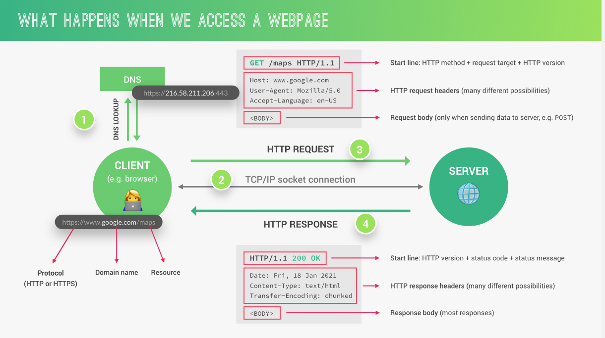

# Desenvolvimento Back-end

### 1. Visão Geral

O desenvolvimento back-end é a parte do desenvolvimento web que não está visível diretamente para o usuário final. O back-end está focado em aspectos como servidores, banco de dados e APIs. 

### 2. O Funcionamento da Web e HTTP

Para ser um programador back-end é crucial conhecer, de maneira geral, o funcionamento da internet. Dentre os aspectos da web, o mais importante para um dev back-end é o protocolo HTTP. 

A web segue a **arquitetura cliente-servidor**, onde clientes fazem requisições a servidores. Os servidores, por sua vez, retornam as respostas solicitadas aos clientes. A comunicação entre cliente e servidor é feita através do protocolo **HTTP (HyperText Transfer Protocol)**. 

Os aspectos do funcionamento do HTTP podem ser explicados da seguinte forma: 
- **Requisição e resposta:** o cliente (geralmente um navegador) envia uma requisição HTTP a um servidor, que então processa a requisição e envia uma resposta ao cliente.
- **Métodos HTTP:** os métodos indicam ao servidor o que deve ser feito. GET (para soliticar dados), PUT (para enviar dados), PUT (para atualizar dados) e DELETE (para remover dados) são alguns dos métodos mais utilizados.
- **URLs:** as requisições HTTP são feitas através de URLs, que especificam o endereço do recurso desejado na internet. Um serviço de DNS é responsável por converter essa URL no endereço IP de onde o recurso se encontra.
- **Cabeçalho e corpo:** As mensagens HTTP consistem em cabeçalhos, que contêm informações sobre a requisição ou resposta, e um corpo, que contém os dados reais (como o conteúdo de uma página web).
- **Status Code:** São códigos utilizados pelo servidor para indicar o resultado de uma requisição (por exemplo, 200 OK para sucesso e 404 Not Found para recurso não encontrado).

### 3. Rotas

As rotas definem como a nossa aplicação irá responder as requisições do cliente, baseado nos diferentes endpoints (URLs). O Node.js, juntamente com o express, disponibiliza maneiras de definir rotas e o que elas irão retornar como resposta ao cliente.

Por exemplo, caso a URL acessada pelo cliente termine em `'/menu'`, a aplicação executará certa ação, que será diferente da ação executada caso o endpoint seja `'/login'`.

### 4. APIs

**APIs (Application Programming Interface)** são conjuntos de regras e protocolos que permitem a comunicação entre dois sistemas de software diferentes, fornecendo uma maneira padronizada de acessar e manipular recursos. 

O Node.js, juntamente com o **express**, disponibiliza todas as ferramentas necessárias para construir nossas próprias APIs.   

