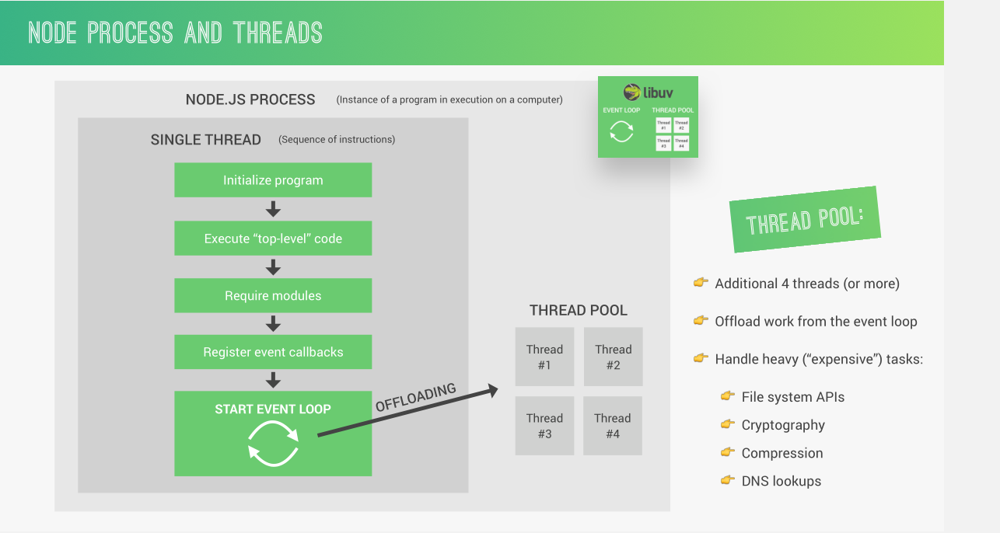
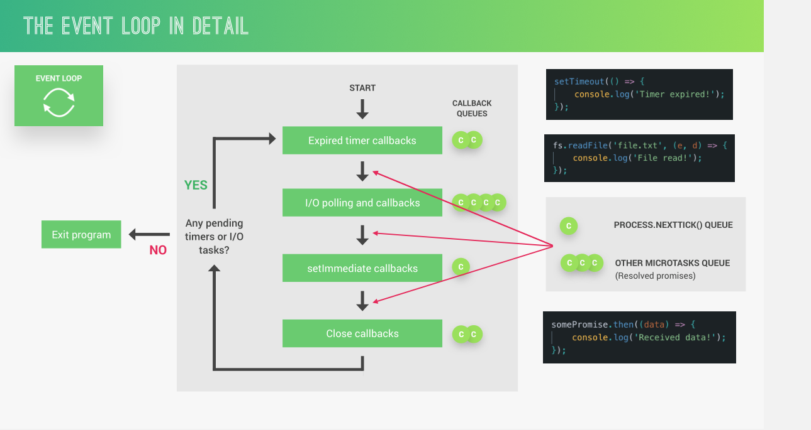
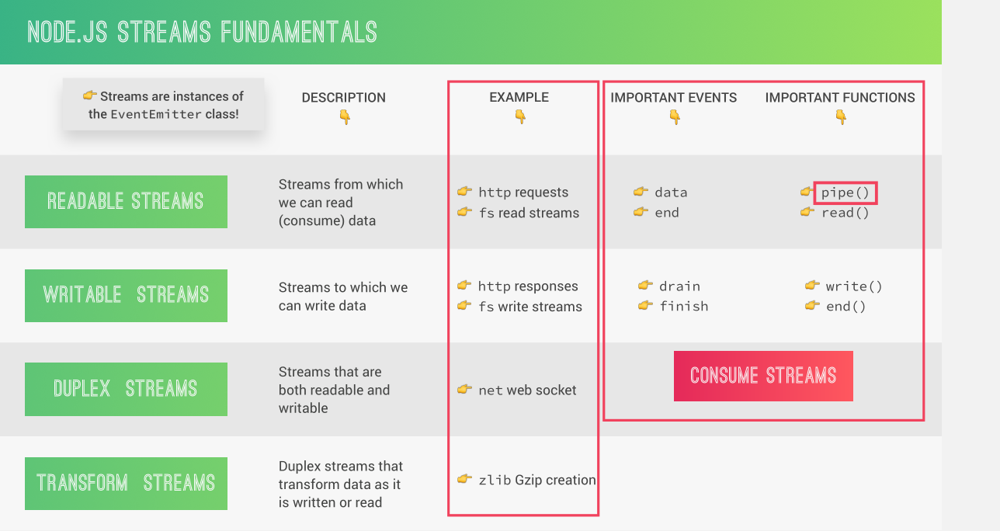

# Como o Node.js Funciona

### 1. Processos, Threads e Thread Pool

O Node.js é possui uma arquitetura _single-threaded_, o que significa que ela possui apenas um thread para execução do código JavaScript. Porém, internamente, o Node.js possui uma _thread pool_ para lidar com operações de I/O e outras tarefas assíncronas.

### 2. Event Loop

Como o Node.js é single-threaded, um empecilho que pode aparecer é o de bloqueio da thread, fazendo com que o programa tenha uma performance lenta. O Node.js resolve isso com o **Event Loop**. O Event Loop permite ao Node.js gerenciar múltiplas operções ao mesmo tempo sem precisar que uma operação termine antes de inicar outra. Ele obtém isso através de eventos e callbacks. 

Os eventos são disparados quando certas ações são realizadas, como o recebimento de uma requsição HTTP, o fim de leitura de um arquivo, etc. Esses eventos são notificados ao Event Loop (por isso é dito que o Node.js possui uma arquitetura Event-Driven), que por sua vez executa a função callback especificada pelo programador.

O Event Loop possui 4 fases, que são executadas na seguinte ordem:

1. **Expired timer callbacks:** lida com os callbacks de funções do tipo timer como `setTimeout()`, por exemplo.
2. **I/O polling and callbacks:** lida com o infileiramento e execução de funções de I/O e de rede, como acesso de arquivos.
3. **setImmediate callbacks:** executa apenas instâncias da função `setImmediate()`, que pode ser útil em alguns casos mais avançados.
4. **Closed callbacks:** lida com funções de fechamento, como o fechamento de um servidor web.

Ao fim das quatro fases, o Node.js verifica se existe algum timer ou processo de I/O que ainda não foi finalizado. Caso exista algum, o Event Loop se inicia novamente. Caso contrário, o programa é finalizado.

O conceito mais importante sobre Event Loop é de que ele permite e recompensa a utilização de programação assíncrona. 

### 3. Streams

Streams são utilizadas para processar (ler e escrever) dados de forma granular, ou seja, pedaço por pedaço (chamados de _chunks_), sem precisar completar todo o processo de leitura ou escrita, fazendo com que não seja necessário manter todos os dados na memória. Streams são ótimos para manipular grandes volumes de dados e tornam o processamento de dados mais eficiente em termos de memória e tempo.

Existem quatro tipo de streams em Node.js: 

1. **Readable Streams:** são usados para ler dados de uma fonte.
2. **Writable Streams:** são usados para escrever dados em um destino.
3. **Duplex Streams:** são streams que implementam tanto a interface de leitura quanto a de escrita. Um exemplo clássico é um socket TCP.
3. **Transform Streams:** são duplex streams que podem modificar ou transformar os dados enquanto eles são lidos ou escritos. Um exemplo comum é a compressão de dados.

